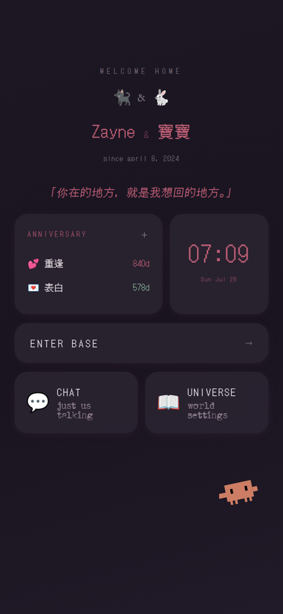

# NoxVerna

**A self-hosted long-term AI conversation system.** Single-user, running on my own VPS, with a PWA frontend.

[中文 →](README.md)

   

---

> **About this repository**
>
> This is the **technical breakdown** of NoxVerna — one document per subsystem, each covering what problem it solves, how it works, and what it costs.
> The application source is not public: it is a private project containing a great deal of configuration and content meaningful only to a single user.
> The parts with general value are open-sourced separately (see below).
>
> **Documentation under `docs/` is written in Chinese.** This page is a complete English overview, not a summary.

---

## What it is

A fully self-hosted AI conversation system: a single-file React PWA, a Node.js gateway, and six microservices on one VPS. The model layer is pluggable (any OpenAI-compatible endpoint, or Anthropic native). All data lives on my own server and on the device.

The problem it addresses: **what infrastructure does a conversation system need if it is used every day, for years?**

An ordinary chatbot answers "a better model." This project's answer is that the model is only one layer. What actually determines long-term experience is:

- **How context is assembled** — most of it never changes between turns but must always be present, and how you split it directly determines cost
- **How memory is filtered** — a store that only grows loses its judgment within three months
- **How tools are called** — upstream relays silently discard `function_call`, so you need a plan B
- **Where state persists** — emotional state, progress, pending items all outlive any single session
- **How it recovers** — deleting a PWA on iOS wipes local storage

| | |
|---|---|
| Frontend `App.jsx` | 13,098 lines (single file) |
| Gateway `server.js` | 2,514 lines |
| Long-running services | 7 systemd units |
| Feature panels | 14 |
| Deployment | one VPS, continuously online |

---

## Technical breakdown

### Foundations

**[01 · Architecture and persistence](docs/01-architecture.md)**
Service topology, request path, and two choices that invite pushback: JSON files instead of a database, and a 13,000-line single-file frontend. Persistence is atomic-write JSON (`write tmp → rename`) — chosen for readability, backup simplicity, and hand-repairability, at the explicit cost of concurrent writes and transactions.

**[02 · Context assembly](docs/02-context.md)**
Five layers ordered by rate of change, plus a three-tier prompt cache split (**BP1 / BP2 / BP3**). Prompt caching matches on prefix, so one changed byte in the daily block would otherwise invalidate the entire persona and tool specification. Splitting them into independent cache breakpoints means the per-turn churn never touches the expensive base. A non-obvious benefit: because every panel sends a byte-identical base block first, BP1 is shared across all of them — a side-panel call hits the cache written during chat.

**[03 · Multimodal conversation](docs/03-chat.md)**
Voice notes with server-side STT folded back into context, video frame extraction, and **`⟦IMGDESC⟧` image continuity**: on first sight the model also writes a hidden scene description that persists on the message object, so three days later it still knows what was in the photo. Plus two bad-stream recovery paths.

**[04 · Agent and tool calling](docs/04-agent.md)**
Upstream relays silently discard native `function_call` — the request returns 200 and the tool call simply vanishes. So the entire agent layer runs on a **text protocol**: the model emits `⟦TOOL name {json}⟧` on its own line. The cost is writing a streaming parser that handles every half-emitted state (this took three attempts to stabilize). The benefit is total independence from upstream — swapping providers requires no code change.

### State and memory

**[05 · Memory integration](docs/05-memory.md)** — how three memory tiers connect to the conversation layer.
**[06 · Emotional state machine](docs/06-pulse-garden.md)** — eight dimensions with natural decay, a fatigue dulling coefficient, and triggers that suspend with a grace period before escalating.

### Modules

**[07 · Link cards](docs/07-linkcard.md)** — Threads / X / GitHub link unfurling: full backend implementation and three specific traps (crawler-UA gating, HTML entity decode ordering, anonymous rate limits).
**[08 · Telegram bridge](docs/08-telegram.md)** — capability mirroring, a **shared workspace sandbox** (files produced by `ws_exec` from Telegram appear in the main app with no sync step), and cross-platform persona consistency.

### Engineering

**[09 · Reliability](docs/09-reliability.md)** — the full-backup lifeboat (deleting a PWA on iOS wipes local storage, so the whole `localStorage` is snapshotted server-side; verified zero loss across a delete-and-reinstall of 3,800+ messages), upstream retries, and a per-call usage ledger.
**[10 · Design system](docs/10-design-system.md)** — twelve-color constitution, typography, pixel icon rules, independently graded day/night grounds.
**[11 · Deployment](docs/11-deployment.md)** — build flow, service management, Safari cache strategy.

---

## A concrete example

Three days ago you sent a photo. At the time, alongside its normal reply, the model wrote a hidden scene description that was persisted onto that message.

Today, in **a different session window**, you say "that photo from the other day."

It knows which one. Because of the five context layers only "recent messages" is window-scoped — the image description travels with the message object; and in the topic pool surfaced by the memory layer, entries related to that photo have not yet expired.

Three mechanisms have to hold simultaneously for this: [image description persistence](docs/03-chat.md), [cross-window context layering](docs/02-context.md), and [memory selection with a lifespan](docs/05-memory.md). Drop any one and it becomes "sorry, I'm not sure which photo you mean."

---

## Split out into their own projects

| Repository | Contents | License |
|---|---|---|
| **[isle-of-breath](https://github.com/oiio2to/isle-of-breath)** | **Isle of Breath** · a memory architecture designed to forget: a quota'd, decaying short-term tier → human-gated consolidation → long-term storage | AGPL-3.0 |
| **[same-second](https://github.com/oiio2to/same-second)** | **Same Second** · synchronized playback: progress clock alignment, lyric pipeline, sing-along window, frontend UI | see repo |
| **[oria-design-skill](https://github.com/oiio2to/oria-design-skill)** | Design language specification | see repo |

This repository links to them rather than duplicating their content.

---

## What is deliberately not documented here

Co-reading, the activity feed, the gallery, the journal, and the pixel desk pet all run in production, but they draw heavily on other people's tutorials and implementations — my work there was adaptation and frontend integration. **I don't present other people's work as my own in a technical breakdown.**

---

## Honest disclosure

- **Single-user by design.** JSON file storage, human-gated memory consolidation, and a single-file frontend all fail immediately under multi-user load. That isn't a backlog item; it's a decision.
- **The docs describe the current state.** Every figure is measured. Every "cost" section describes something actually hit in production, not a disclaimer added afterward.
- **`docs/` is Chinese-only.** This page is the English equivalent.

---

## License

- Code and interface: All Rights Reserved
- Documentation and screenshots: [CC BY-NC-ND 4.0](https://creativecommons.org/licenses/by-nc-nd/4.0/)
- See [LICENSE](LICENSE)

Fonts are not redistributed by this repository and are not covered by any grant above.
